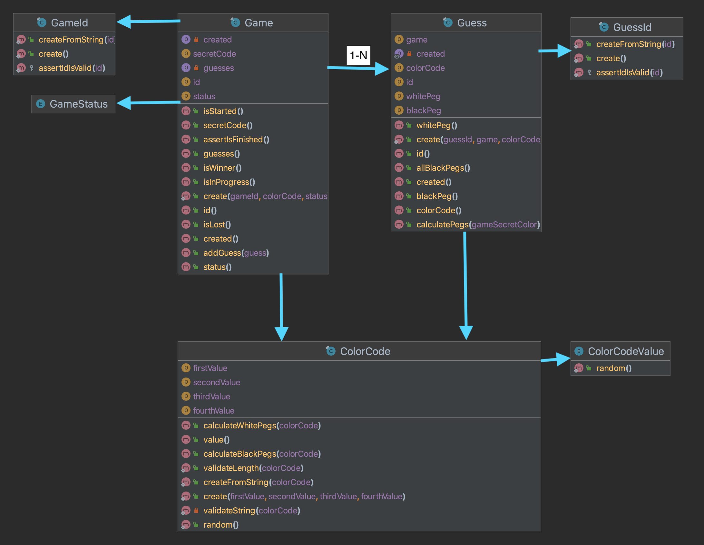

# Bootstrap
First we need to generate some configuration files to the project start working.

## Configuration files
This will generate some files, we need to change the value for:

* infra/mysql/.env.mysql
* .env.local
* .env.test.local

And add the desired database credentials defined in the first place

```
make init
```

## Docker setup

Before setting up the project, we need to decide if we want the dev version of php (composer & xdebug)

```
make build-dev
```

or the production ready.

```
make build-prod
```

When we have all the files in places, to setup the project then we need to do execute

```
make up
```

This will create the needed containers (mysql, php and nginx).

## Dependencies

When everything is up and running first of all we need to install composer dependencies

```
make composer-install 
```

## Database

First of all we need to create the databases for development and testing

```
make create-database-dev
```

```
make create-database-test
```

And after that we need to launch database migrations

```
make execute-migrations-test
```

```
make execute-migrations-dev
```

## Testing
To verify that everything works as expected we can launch the tests. We can decide if we want to run unit

```
make unit-tests
```

functional

```
make functional-tests
```

or to run all

```
make all-tests
```

## Code coverage
Is super important to have in mind that for the coverage is needed xdebug, so before running be sure that you are using the dev version of the docker image.

As the test we have coverage reports for unit

```
make coverage-unit
```

functional

```
make coverage-functional
```

or for all

```
make coverage-all
```

This will generate reports in the folder coverage/(unit|functional|all) depending on the action used.

## Postman collection

Also if you want to play a bit with the project you can use the postman collection `Mastermind.postman_collection.json`

# Questions

## What is your favourite package manager and why?
Since I have been working a lot of years with PHP I use composer. This become the de facto package manager in the industry.

I also have some experience with node/npm (JS) and a small experience with pip (Python).

With the version 2 of composer, comes a lot of improvements:
* Install multiple packages at once
* Less memory usage
* Better dependency resolution
* Increased security
* 

## What architecture did you follow for this project?
* Hexagonal or ports and adapters as a layered architecture
  * Domain: Here goes our business core, all the logic of our application, the things that matter, and we need to take care of it
  * Application: Here goes all the use cases query, command and event listener
  * Infrastructure: Here all the implementations of the interfaces we define in model, thanks to this we are more decoupled from third party
* DDD (Domain Driven Design)
  * Value objects: To model some concepts that don't have identity but need representation
  * Repositories: To make operations with the database
  * Bounded context: Define the multiple contexts of our domain, in this case we have MastermindContext and Shared to add things across contexts
  * Ubiquitous Language: Use the same terminology across all the domain, services, classes to unity
  * Entities: Avoid anemic models and make entities rich and avoid having implementation details on it
  * Aggregates: Combination of multiple entities, in our case Game & Guess
  * Domain Services: To orchestrate some logic between the domain when is not possible to add in one side or another
* CQRS: 
  * To make more decoupled the call to the use case, each command/query have a relation of 1:1 with the handler
    * Command: Action to modify the state of the system, usually related with PUT, PATCH, POST and DELETE http methods
    * Query: Action to obtain the state of the system, usually related with GET http methods
    * Command/Query bus: Bus to transport command/queries. The advantage is that you only need this as dependency and will transport to the respective handler

## Do you know and understand UML? What would the class diagram of the domain exposed in the mastermind game be like for you?
This UML diagram only include entities and value objects, also I only exposed the public methods because are the ones interesting. 


## What tools are you aware of to handle things like code styling and consistency, formatting, typing...?
In php there are plenty of tools for this purpose, here are some of them:
* [PHP CS Fixer](https://cs.symfony.com/): This is used in this project, is super useful because you can add the rules you want and run anytime you want to format your code
* [Psalm](https://psalm.dev/): This one never used but hear good things of it, is from vimeo so is quite well tested. Other tool to make code fixings
* [Rector](https://getrector.com/): This one is super-useful, not only to make quick adaptations of the code but also to make library and framework migrations
* [SonarCloud|SonarQube](sonarcloud.io): A tool that can be deployed on our systems or live in the cloud, notify about low coverage, technical debt or some security issues
* [PHP MD](https://phpmd.org/): This one lost a bit of popularity lately, but in his time was a good choice also, another tool to review cyclomatic complexity and some code improvements
* [ESLint](https://eslint.org/): Used in the javascript ecosystem, not used but hear is one of the most useful tools to clean and adapt code
* [PyLint](https://pylint.readthedocs.io/en/latest/): Linter for python code

There are a lot of other tools, for the different languages and platforms.

## Is there anything you would like to comment about the project, this small exercise, etc.?
### Infrastructure
Used docker and docker-compose to develop this application because is easy to bootstrap, configure and share with others.

Used the multi-stage builds in the Dockerfile to simplify and avoid having dependencies and libraries in production environment.

I choose PHP (8.2) as a programming language and Symfony (6) as the main framework. 

MySQL was used for the database because is one of the most common choices with PHP.

Nginx was used for web server for the easy configuration and good performance.

### Approach
For the development of the application I follow an approximation of BDD.

With this strategy I was able to start from the top, the request to the endpoint and go deeper to the implementation details. 

This give me the possibility to avoid early refactoring or optimization and validate the logic.

### Testing
As commented before I started with the functional tests to validate all the endpoints.

When all the endpoints was working and the logic was the expected then I continued with the unit tests and do some refactors on the way and validation each time that the functional tests was not broken.

This was an interesting approach to me because I can focus first on delivery value first and later go for the optimization/refactor.

### Next steps
To improve the project we can do some other features to enrich the experience

* Add users
  * Track games created
  * Track games played
  * Statistics about the games (played, win, lost, created, average about how many guesses)
  * Ranking of users
  * Edit the game when is started and don't have any guess
* Event Sourcing
  * Add domain events to the entities so each one can record their own events
  * Create the event store with all the events
    * Game Created
    * Guess added
    * Game won
    * Game lost
    * User login
    * User logout
* Create a web interface to represent the game
* Use cache for the finished game for example to retrieve it faster
